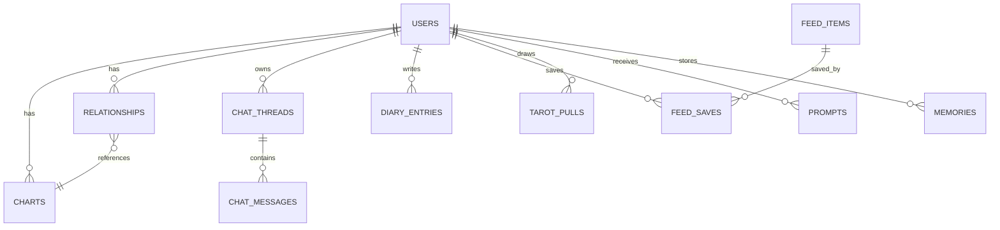

# Data Model + Tables Outline

## Goals
- Support core loops: onboarding, chat, diary, feed, relationships, tarot.
- Keep schema flexible for future chart precision and prediction markets.

## Tables

## Relationship Diagram

### users
- `user_id` (UUID, primary)
- `email` (string, optional)
- `created_at` (timestamp)
- `timezone` (string)
- `persona_name` (string, optional)
- `persona_style` (string, optional)
- `diary_cadence` (daily | weekly | off)
- `settings` (jsonb: privacy toggles)

### charts
- `chart_id` (UUID, primary)
- `user_id` (UUID, ref)
- `birth_date` (date)
- `birth_time` (time, optional)
- `birth_time_precision` (exact | approximate | unknown)
- `birth_location` (string, optional)
- `sun_sign` (string)
- `moon_sign` (string, optional)
- `rising_sign` (string, optional)
- `raw_chart_payload` (jsonb, optional)
- `created_at` (timestamp)

### relationships
- `relationship_id` (UUID, primary)
- `user_id` (UUID, ref)
- `label` (string)
- `type` (boyfriend | best_friend | situationship | custom)
- `person_name` (string)
- `chart_id` (UUID, optional)
- `sun_sign` (string, optional)
- `created_at` (timestamp)

### chat_threads
- `thread_id` (UUID, primary)
- `user_id` (UUID, ref)
- `title` (string, optional)
- `created_at` (timestamp)
- `updated_at` (timestamp)
- `memory_enabled` (boolean)
- `summary` (string, optional)

### chat_messages
- `message_id` (UUID, primary)
- `thread_id` (UUID, ref)
- `user_id` (UUID, ref)
- `role` (user | assistant)
- `content` (string)
- `created_at` (timestamp)

### diary_entries
- `entry_id` (UUID, primary)
- `user_id` (UUID, ref)
- `title` (string, optional)
- `body` (string)
- `mood` (string, optional)
- `prompt_id` (UUID, optional)
- `astro_tags` (jsonb, optional)
- `created_at` (timestamp)

### feed_items
- `feed_id` (UUID, primary)
- `type` (personal | tea | prompt | celebrity)
- `title` (string)
- `body` (string)
- `tags` (jsonb)
- `created_at` (timestamp)
- `expires_at` (timestamp)
- `source` (human | ai)

### feed_saves
- `save_id` (UUID, primary)
- `user_id` (UUID, ref)
- `feed_id` (UUID, ref)
- `created_at` (timestamp)

### tarot_pulls
- `pull_id` (UUID, primary)
- `user_id` (UUID, ref)
- `card_id` (string)
- `interpretation` (string)
- `created_at` (timestamp)

### prompts
- `prompt_id` (UUID, primary)
- `type` (daily | weekly)
- `text` (string)
- `created_at` (timestamp)

### memories (optional Phase 1)
- `memory_id` (UUID, primary)
- `user_id` (UUID, ref)
- `summary` (string)
- `created_at` (timestamp)

## Indexing Notes
- `chat_messages` by `thread_id` + `created_at`
- `diary_entries` by `user_id` + `created_at`
- `feed_items` by `created_at` + `type`
- `relationships` by `user_id`

## MVP Notes
- Keep chart calculations out of schema logic for now.
- Use raw payload for future API integration.
- Avoid heavy analytics in P0.
