# State Machine Diagrams

Visual representation of component state flows in Project Astra.

---

## 1. Onboarding Flow

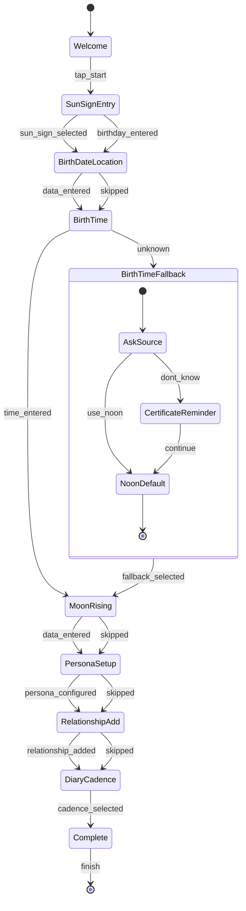

**States:**
| State | Required | Data Captured |
|-------|----------|---------------|
| Welcome | - | - |
| SunSignEntry | ✅ | `sun_sign` |
| BirthDateLocation | ○ | `birth_date`, `birth_location` |
| BirthTime | ○ | `birth_time`, `birth_time_source` |
| MoonRising | ○ | `moon_sign`, `rising_sign` |
| PersonaSetup | ○ | `persona_name`, `voice_style` |
| RelationshipAdd | ○ | First relationship |
| DiaryCadence | ✅ | `diary_cadence` |

---

## 2. Chat Thread Lifecycle

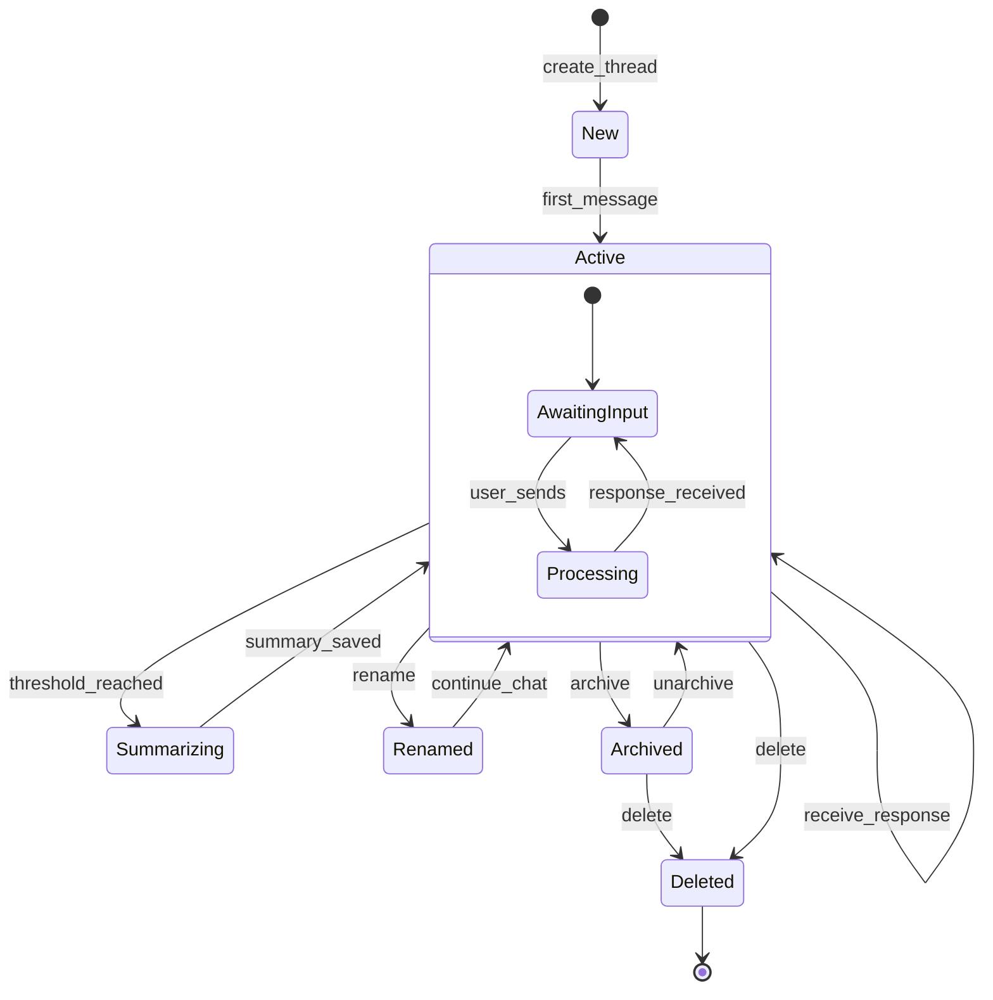

**Memory States (per-thread):**
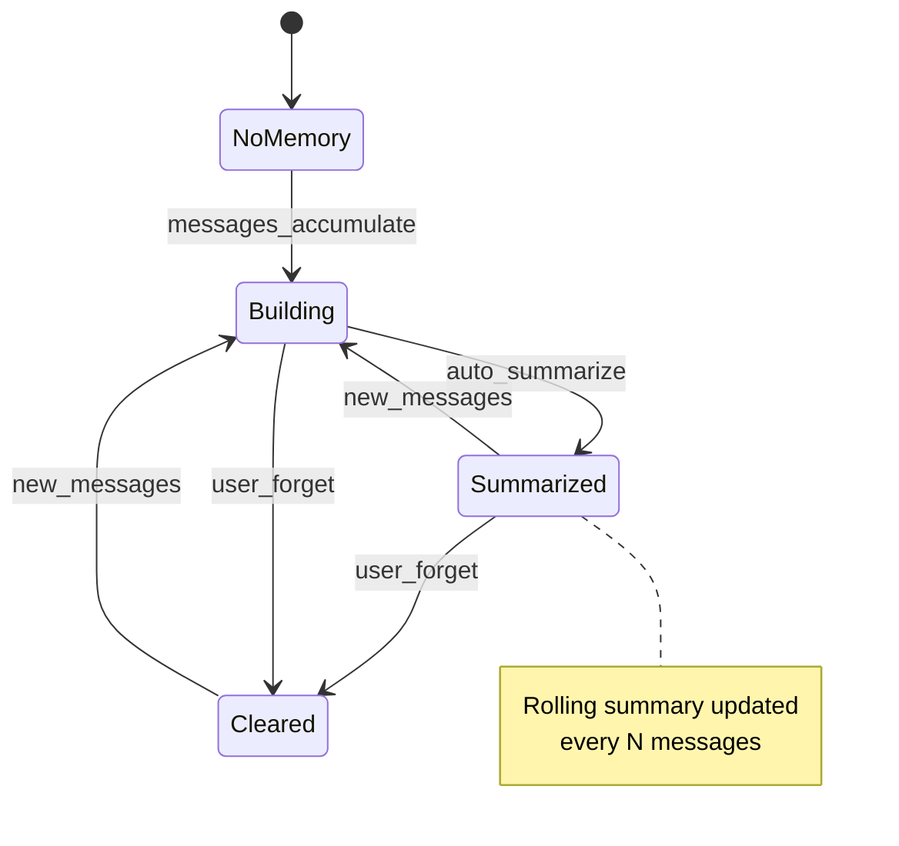

---

## 3. Diary Entry Lifecycle

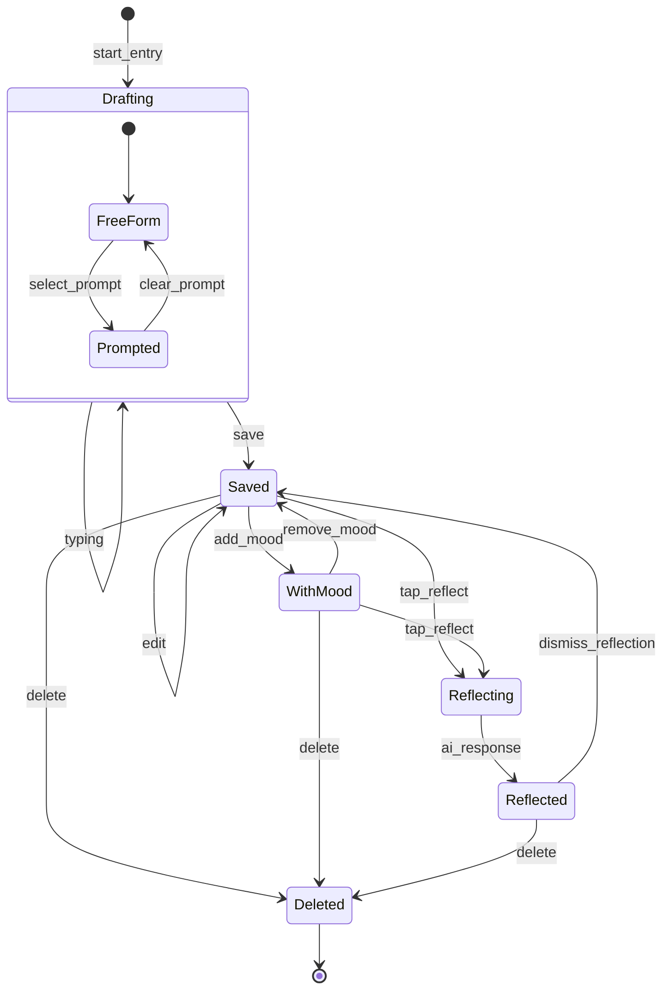

**Prompt Delivery States:**
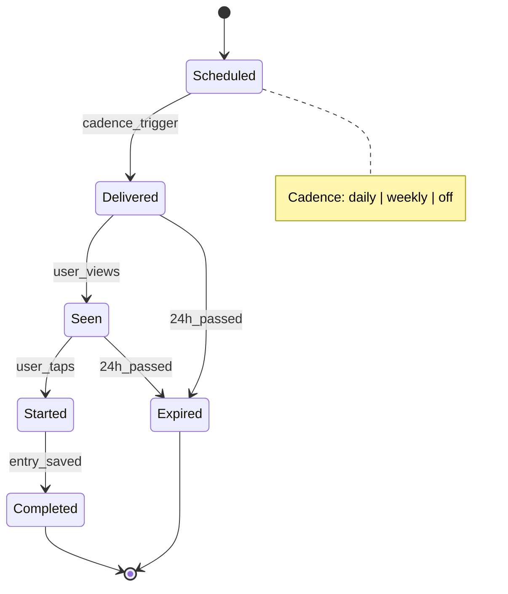

---

## 4. Feed Item Lifecycle

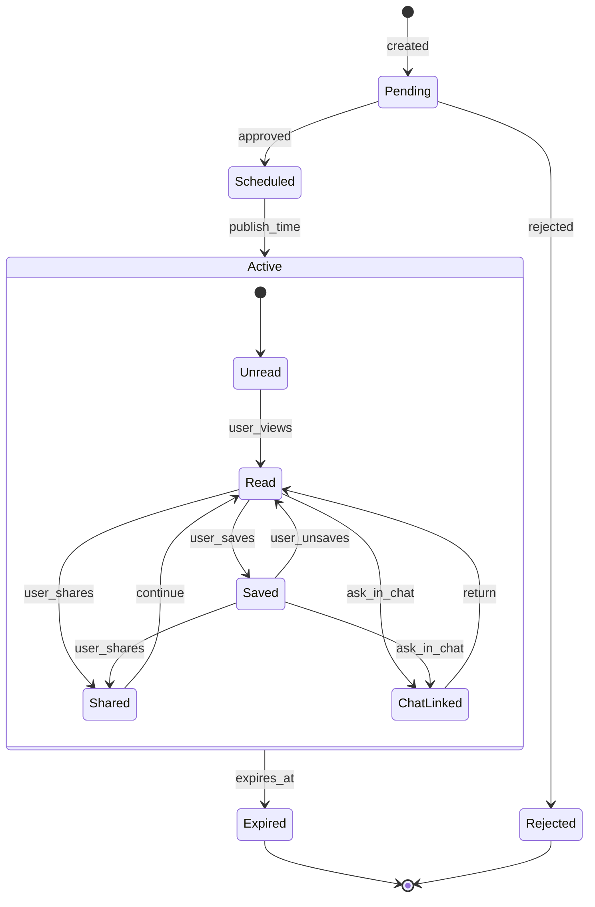

**Feed Item Types:**
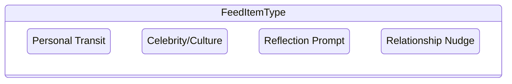

---

## 5. Tarot Pull Flow

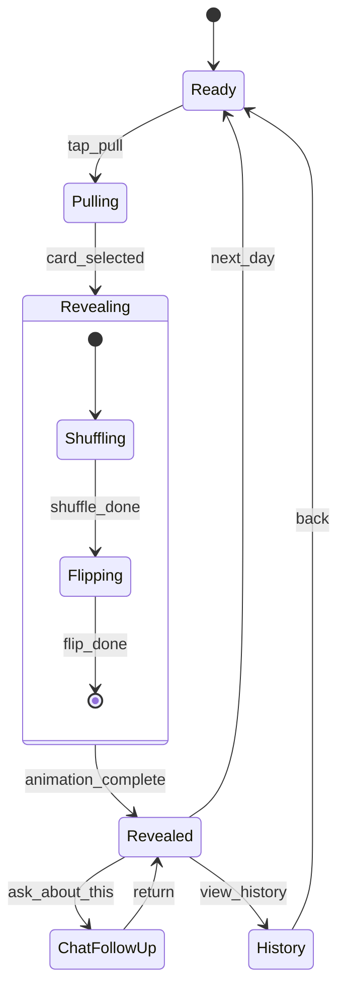

**Daily Pull Availability:**
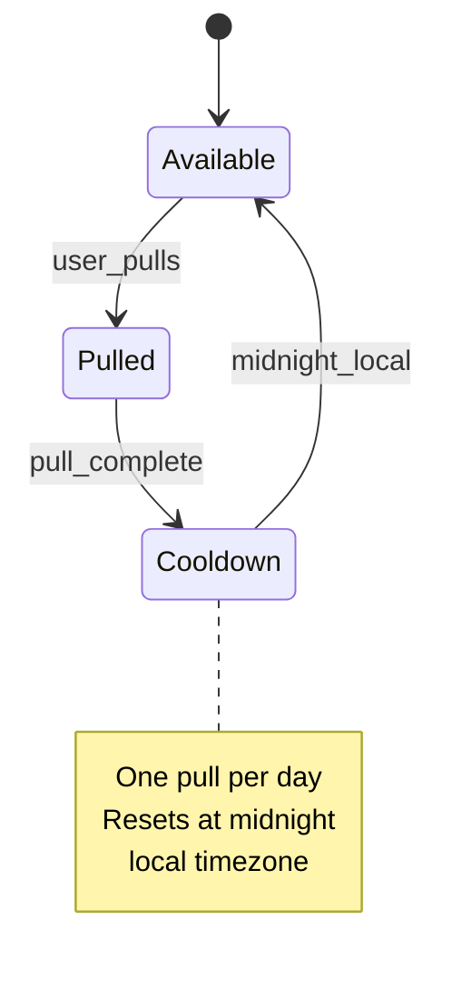

---

## 6. Relationship Lifecycle

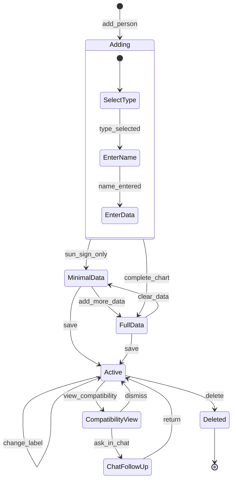

**Relationship Types:**
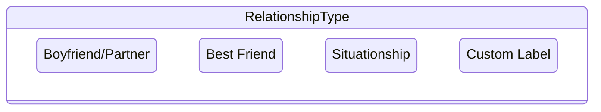

---

## 7. User Session States

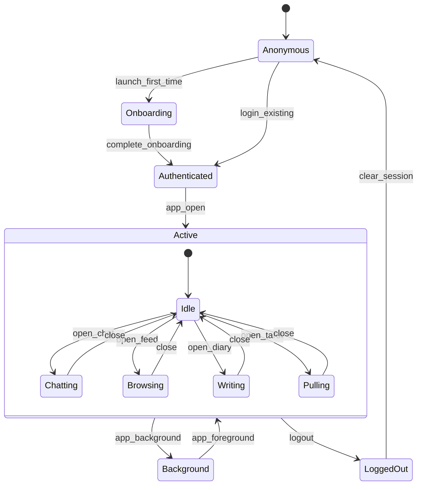

---

## 8. Memory & Privacy Controls

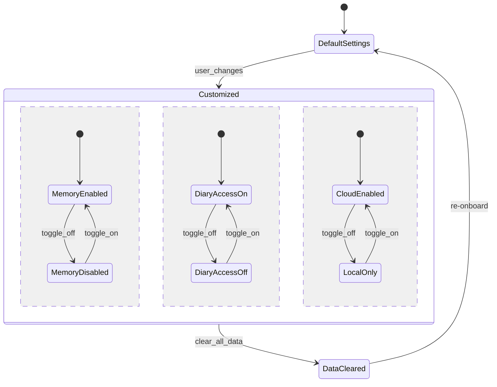

**Deletion Cascade:**
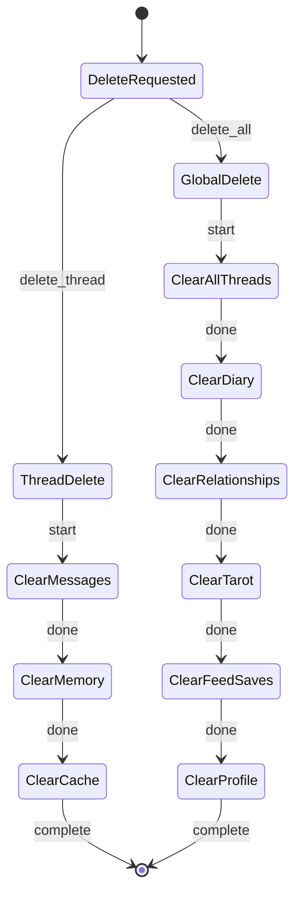

---

## 9. AI Response Pipeline

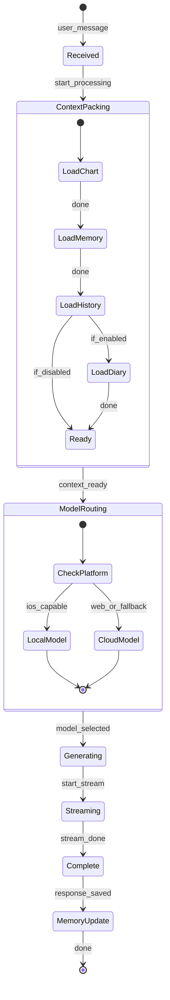

---

## State Legend

| Symbol | Meaning |
|--------|---------|
| `[*]` | Start/End state |
| `-->` | Transition |
| `state { }` | Nested/composite state |
| `: action` | Transition trigger |
| `note` | Additional context |
